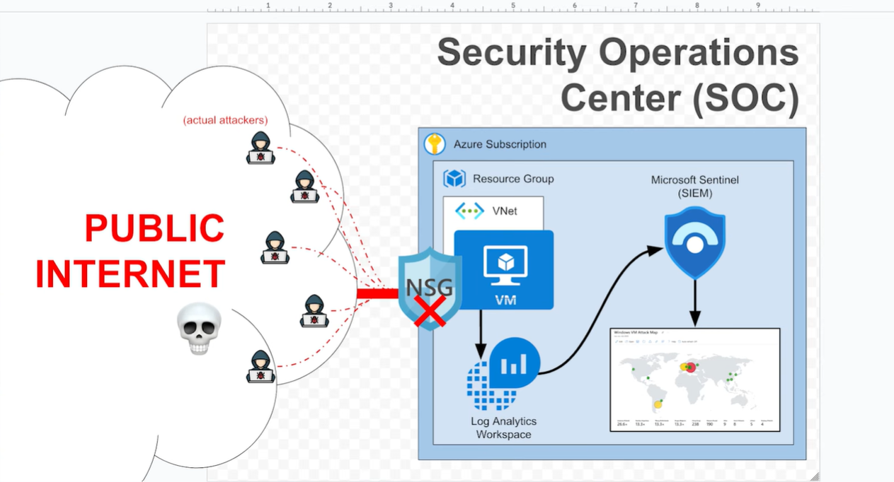
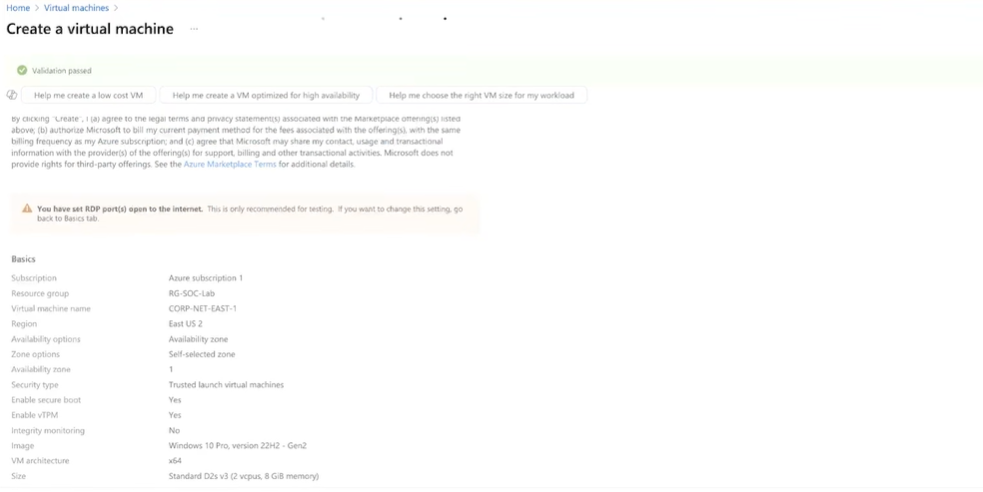
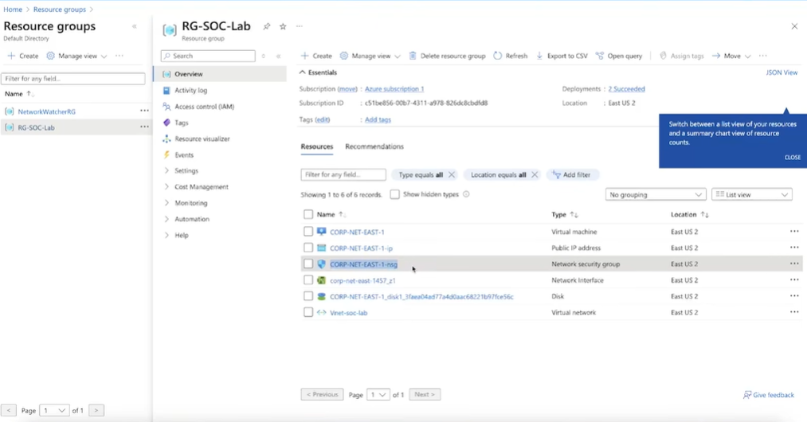
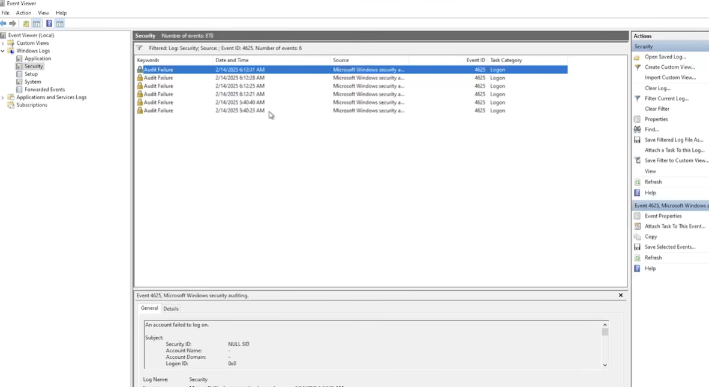
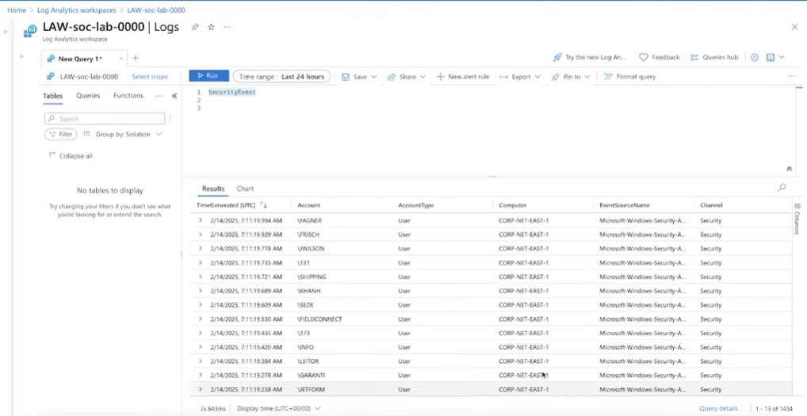
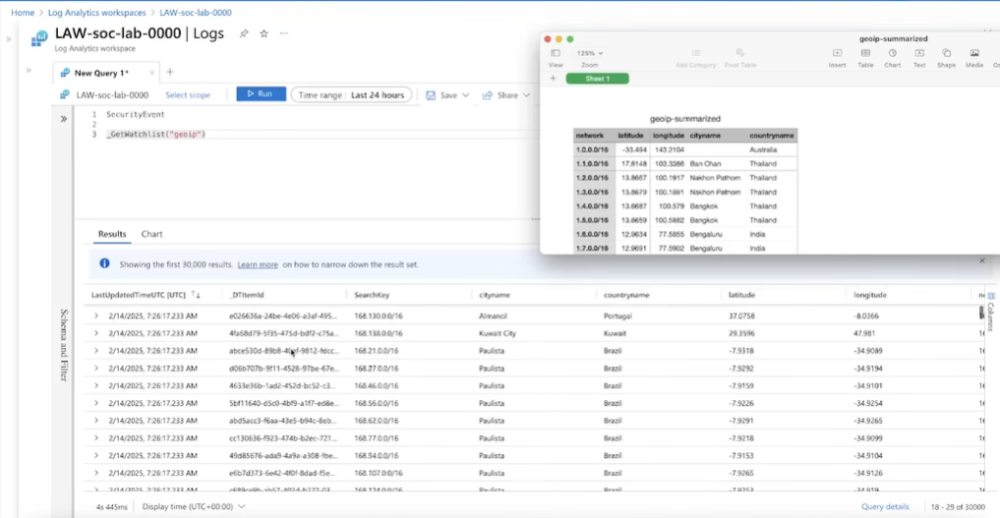
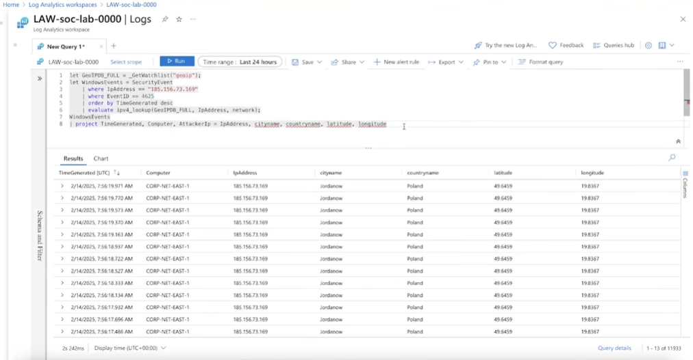
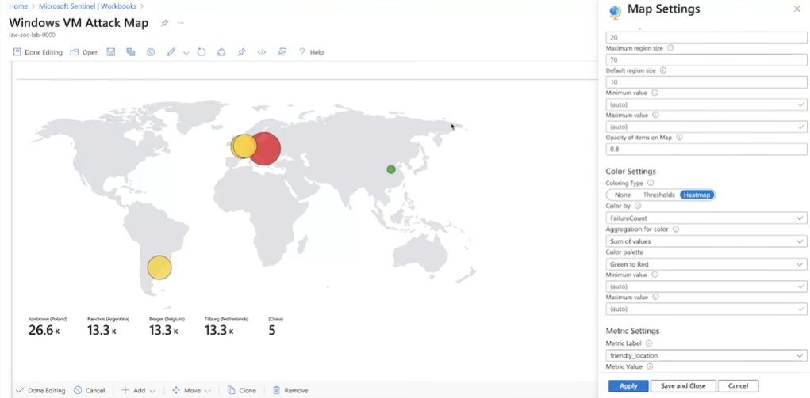

# Azure SOC Homelab using Honeypot and Microsoft Sentinel

## Overview

This project demonstrates the deployment of a cloud-based Security Operations Center (SOC) homelab using Microsoft Azure and Microsoft Sentinel.

The objective was to build a Windows honeypot, collect and analyze security logs, monitor failed login attempts, enrich logs with geographic information, and visualize attacker activity using Microsoft Sentinel.

This lab provides hands-on experience with SIEM operations, log analysis, cloud security monitoring, and threat detection.

---

## Project Objectives

* Deploy a Windows virtual machine in Microsoft Azure
* Configure the VM as a honeypot
* Collect Windows Security Event Logs
* Forward logs to Azure Log Analytics Workspace
* Connect Microsoft Sentinel to the environment
* Analyze security events using Kusto Query Language (KQL)
* Enrich attacker IP addresses with GeoIP data
* Visualize attacks on a geographic attack map

---

## Technologies Used

### Cloud Platform

* Microsoft Azure

### Security Tools

* Microsoft Sentinel
* Azure Log Analytics Workspace

### Operating System

* Windows Server

### Logging & Monitoring

* Windows Event Viewer
* Azure Monitor Agent (AMA)

### Query Language

* Kusto Query Language (KQL)

### Networking

* Azure Virtual Network (VNet)
* Network Security Groups (NSG)

---

## Architecture

```text
Internet
    │
    ▼
Windows Honeypot VM
    │
    ▼
Azure Monitor Agent
    │
    ▼
Log Analytics Workspace
    │
    ▼
Microsoft Sentinel
    │
    ▼
KQL Analysis & Attack Map
```

---

## Project Workflow

### 1. Azure Environment Setup

* Created an Azure Resource Group
* Configured Virtual Network (VNet)
* Deployed a Windows Server Virtual Machine
* Configured networking and public access

### 2. Honeypot Configuration

* Assigned a public IP address
* Allowed inbound RDP traffic
* Configured Network Security Group rules
* Generated security events through internet exposure

The virtual machine was intentionally exposed to attract unauthorized login attempts and generate security telemetry.

### 3. Log Collection

Windows Security Events were collected from the virtual machine and forwarded to Azure Log Analytics Workspace using Azure Monitor Agent.

Key Event IDs monitored:

| Event ID | Description      |
| -------- | ---------------- |
| 4624     | Successful Logon |
| 4625     | Failed Logon     |
| 4634     | Logoff           |
| 4688     | Process Creation |

### 4. Microsoft Sentinel Integration

* Created a Log Analytics Workspace
* Connected Microsoft Sentinel
* Configured Windows Security Events via AMA Connector
* Verified successful log ingestion

### 5. KQL Log Analysis

Example query used to investigate failed login attempts:

```kql
SecurityEvent
| where EventID == 4625
| order by TimeGenerated desc
```

Example query used to count failed logins:

```kql
SecurityEvent
| where EventID == 4625
| summarize FailedAttempts = count() by Account
| order by FailedAttempts desc
```

### 6. GeoIP Enrichment

A GeoIP watchlist was imported into Microsoft Sentinel to enrich attacker IP addresses with geographic information.

This enabled identification of:

* Source Country
* Source City
* Latitude
* Longitude

### 7. Attack Map Visualization

A Microsoft Sentinel Workbook was created to display attack activity geographically.

The attack map visualized:

* Source Countries
* Source IP Addresses
* Failed Login Attempts
* Global Attack Distribution

---

## Screenshots

### 1. SOC Architecture



### 2. Azure Virtual Machine Deployment



### 3. Resource Group Overview



### 4. Failed Login Events (Event ID 4625)



### 5. Log Analytics Workspace Security Logs



### 6. GeoIP Watchlist Import



### 7. GeoIP Enriched Security Events



### 8. Microsoft Sentinel Attack Map



---

## Skills Demonstrated

### Cloud Security

* Azure Administration
* Resource Management
* Virtual Networking

### Security Operations

* SIEM Administration
* Threat Monitoring
* Event Analysis
* Security Investigation

### Log Analysis

* Windows Event Logs
* Kusto Query Language (KQL)

### Incident Detection

* Failed Login Analysis
* Brute Force Detection
* Geographic Threat Analysis

---

## Key Learnings

* Understanding Azure cloud infrastructure
* Deploying and managing virtual machines
* Collecting and forwarding security logs
* Using Microsoft Sentinel for security monitoring
* Writing KQL queries for threat investigation
* Enriching security data with GeoIP intelligence
* Visualizing attacker activity using Sentinel Workbooks

---

## Future Improvements

* Create custom Sentinel Analytics Rules
* Configure Automated Incident Response
* Integrate Threat Intelligence Feeds
* Simulate Real-World Attack Scenarios
* Perform Advanced Threat Hunting with KQL

---

## Repository Structure

```text
Azure-SOC-Homelab-Honeypot-Sentinel/
│
├── architecture/
├── kql-queries/
├── screenshots/
├── README.md
└── LICENSE
```

---

## Author

Vishal Kumar R

Cybersecurity Enthusiast | SOC Analyst Aspirant | Cloud Security Learner
